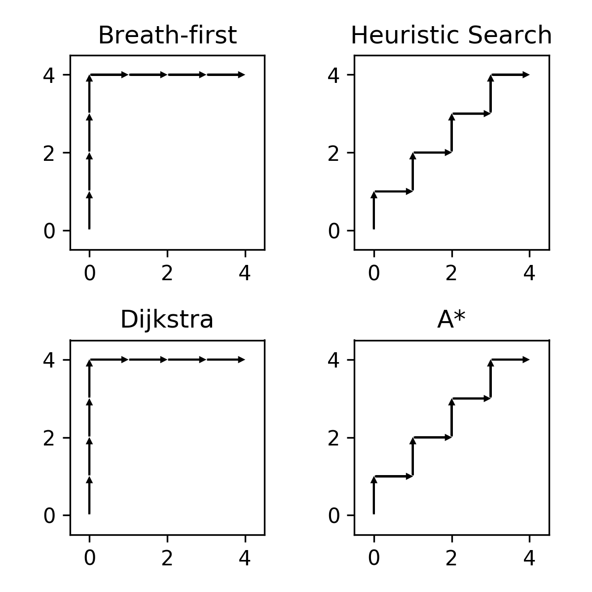
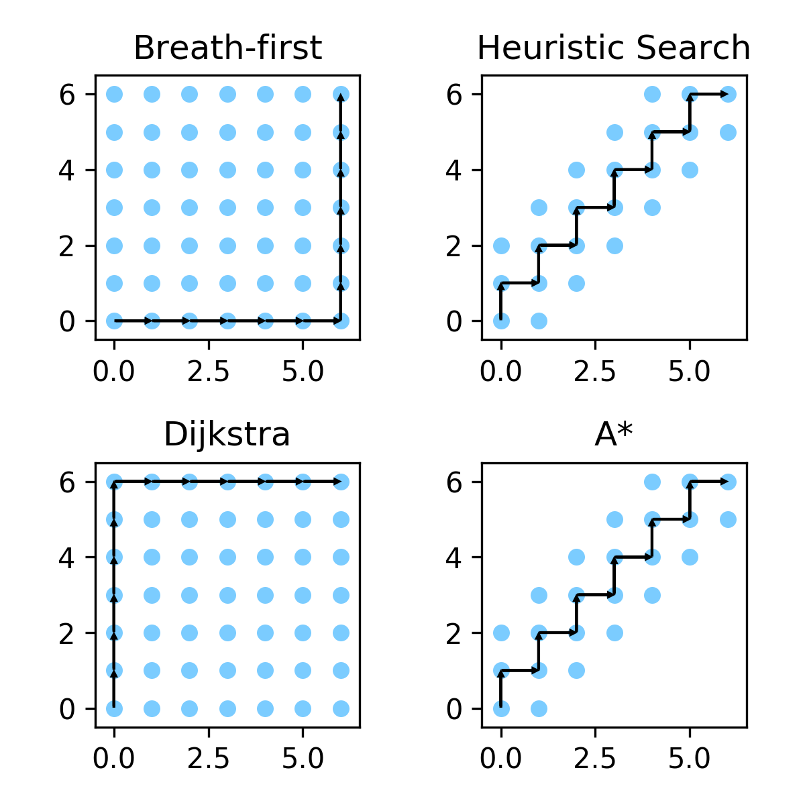
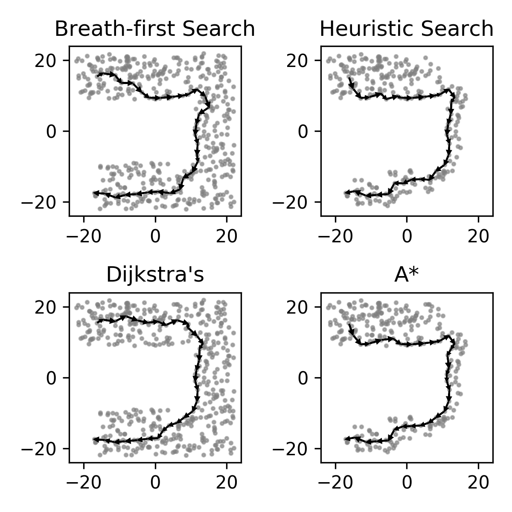
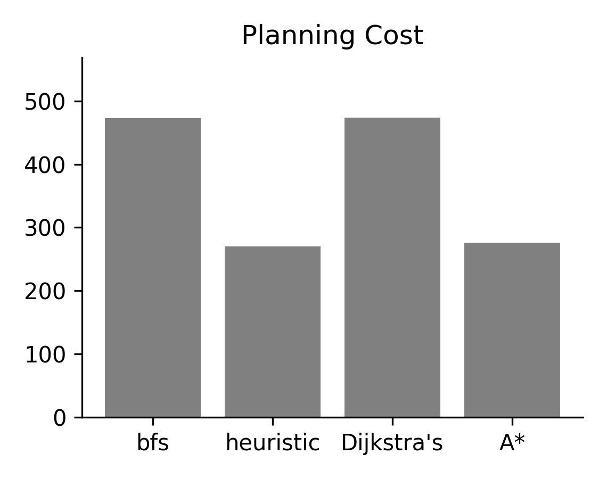
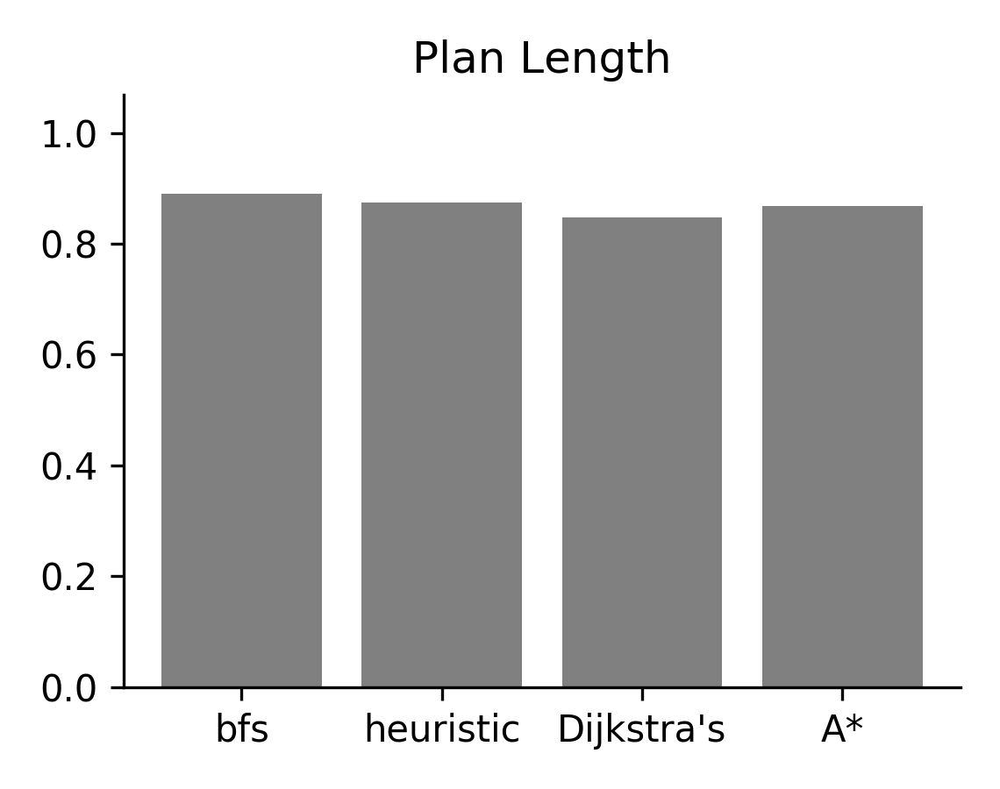

# Graph Search Algorithms

A small collection of graph-search algorithms and analysis.

## Constructing and Visualizing the State Graph

use a grid-graph.

## Graph Search Algorithms

- *breath first*: use path_length and push order as priority.
- *heuristic*: use D(next, goal) as priority.
- *dijkstra*: use path_length as priority.
- *a**: use d(path) + D(next, goal) as priority.

This is reflected in the implementation in [./graph_search](./graph_search/__init__.py).

   

## Prioritized Search and Heuristics

A planning heuristic helps reduce the planning expenditure. The left column are breath-first-search and dijkstra, both do not use a planning heuristic. On the right are heuristic search and A*.

The blue colored dots represent the nodes the search algorithm has "touched". Heuristics help reduce the cost during planning.

   

To visualize which node has been touched, we use the code in [analysis.py](./graph_search/analysis.py). Because the heuristics is L2 whereas the planning distance is L1, we have to scale it up to get this result.

   method   | priority 
:---------: | ----------
 dijkstra's | `D(next)`, the length to the node
 A*         | `D(next) + H(next, goal) * scale`.
 
> Note: in order for A* to find the shortest path, the heuristics need to be "admissible". Otherwise there is no guarantee. Here our scaling factor breaks this assumption.

## Maze Environment Planning Result

Now we can compare the planning cost between these algorithms on the maze environment. We use a simple Euclidean distance as our heuristics (axis ticks in cm).

   

We can compare the number of distance look-ups that are required among these methods:

       
       

With a learned reacheability heuristics, `plan2vec` should do better than `A*` with a Euclidean heuristic.

(The planning lenght is not computed using the weights)

## Graph Interface

We need three methods:

- `get_edge_data(node, node_2)`
- `neighbors(node)`
- `heuristics(next, goal)`
