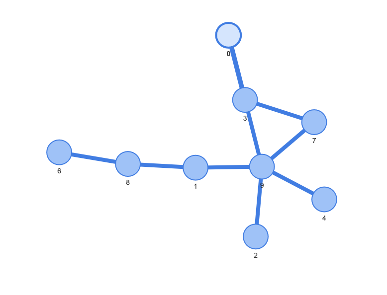

# graph_search

collection of graph-search algorithms

## Constructing and Visualizing the State Graph

We can construct a simple graph with random edge generated
with a threshold of 0.9.

## Graph Search Algorithms

- *breath first*: use path_length and push order as priority.
- *heuristic*: use D(next, goal) as priority.
- *dijkstra*: use path_length as priority.
- *a**: use d(path) + D(next, goal) as priority.

This is reflected in the implementation in [./graph_search](./graph_search/__init__.py).

## Graph Interface

We need three methods:

- `get_edge_data(node, node_2)`
- `neighbors(node)`
- `heuristics(next, goal)`
